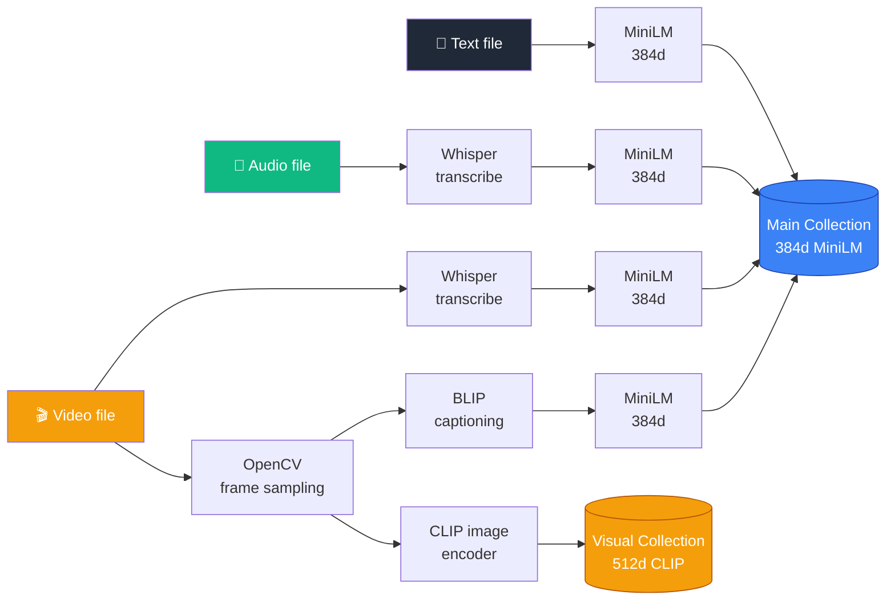
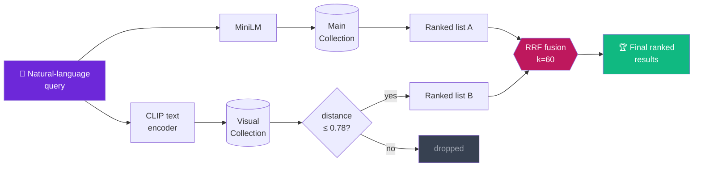

<div align="center">

# 🔎 Multi-Modal AI Embedding System

### Cross-modal semantic search over text, audio, and video — built from the ground up with free, local models.

[](https://www.python.org/)
[](https://fastapi.tiangolo.com/)
[](https://streamlit.io/)
[](https://www.trychroma.com/)
[](https://opensource.org/licenses/MIT)
[]()

*An SPS Internship Capstone Project · [Project Report](docs/REPORT.md) · [Walkthrough Video](#) (coming soon)*

</div>

---

## ✨ Overview

This system ingests **text, audio, and video** files, transforms them into dense vector embeddings using state-of-the-art models, and enables **natural-language semantic search that crosses modality boundaries**.

Type *"how do I make spaghetti"* — get a cooking article.
Type *"a person at a desk with a laptop"* — get a video frame at the matching timestamp.
Speak a query into a microphone — get the most relevant text document back.

All powered by **two ChromaDB collections, Reciprocal Rank Fusion, and a CLIP distance gate** that filters noise before merging results.

---

## 🎯 Cross-Modal Capabilities

The system handles all four query directions required by the project brief:

| # | Query Type | Example | Path |
|---|---|---|---|
| 1 | **Text → Text** | *"how do I make spaghetti"* | MiniLM → main collection |
| 2 | **Text → Audio** | *"greenhouse gases and fossil fuels"* | MiniLM → audio transcripts |
| 3 | **Text → Video** | *"a person at a desk with a laptop"* | CLIP frames + BLIP captions + Whisper transcripts (3 paths) |
| 4 | **Audio → Text** | Spoken: *"Tell me about climate change"* | Whisper transcribe → MiniLM search |

---

## 🏗 Architecture

### Ingestion Pipeline



### Search Pipeline (Reciprocal Rank Fusion)



### Why this design

- **Two embedding spaces** because MiniLM and CLIP optimize for different things — semantic text similarity vs. image–text joint alignment. Forcing everything into one space loses signal.
- **RRF over score normalization** because raw cosine similarities from MiniLM and CLIP aren't directly comparable; rank-based fusion is robust to scale differences.
- **CLIP distance gating at 0.78** because CLIP returns *some* result for any query, even when nothing matches well. The threshold (calibrated against the test dataset) drops noise before it contaminates the fused ranking.

---

## 🧰 Tech Stack

| Component | Tool | Role |
|---|---|---|
| Text embeddings | `sentence-transformers/all-MiniLM-L6-v2` | 384d semantic text vectors |
| Audio transcription | `openai-whisper` (base) | Speech → text |
| Visual embeddings | `open_clip_torch` ViT-B-32 (OpenAI weights) | Joint image-text space (512d) |
| Image captioning | `Salesforce/blip-image-captioning-base` | Frame → caption text |
| Vector store | ChromaDB | Persistent local DB, two collections |
| Frame sampling | OpenCV | Keyframe extraction at fixed intervals |
| Audio extraction | FFmpeg | Strip audio track from video |
| Backend | FastAPI + Uvicorn | REST API with Swagger docs |
| Frontend | Streamlit | Demo UI with cross-modal search |

**100 % free, 100 % local.** No paid APIs, no API keys, no rate limits, no external data egress.

---

## 🚀 Quickstart

### 1. Setup

```powershell
git clone https://github.com/ZarmanSattar/multimodal-search.git
cd multimodal-search
py -3.11 -m venv .venv
.venv\Scripts\Activate.ps1
pip install -r requirements.txt
```

> First run will download ~1.8 GB of model weights to `~/.cache/` (MiniLM, Whisper, CLIP, BLIP). One-time only.

### 2. Ingest sample data

```powershell
python -m scripts.ingest_text_test    # 3 text articles
python -m scripts.ingest_audio_test   # 1 audio file
python -m scripts.ingest_video_test   # 1 video file (~3-5 min)
```

### 3. Run the system

**Option A — Streamlit UI (recommended):**

```powershell
# Terminal 1
uvicorn src.api:app --reload

# Terminal 2
streamlit run app.py
```

Open `http://localhost:8501` and try the four demo queries from the **Examples** buttons.

**Option B — REST API directly:**

```powershell
uvicorn src.api:app --reload
# Open http://localhost:8000/docs for Swagger UI
```

**Option C — CLI:**

```powershell
python -m scripts.search "how do I make spaghetti"
python -m scripts.search "a person at a desk with a laptop" --k 5 --debug
python -m scripts.search_by_audio data\queries\query_climate.mp4
```

---

## 🔌 API Reference

The FastAPI backend exposes seven endpoints. Full interactive docs at `/docs`.

| Method | Endpoint | Purpose |
|---|---|---|
| `GET` | `/` | API info & endpoint list |
| `GET` | `/stats` | Collection sizes |
| `POST` | `/search` | Text query → ranked results |
| `POST` | `/search/audio` | Audio query → Whisper transcribe → search |
| `POST` | `/ingest/text` | Upload & ingest `.txt` file |
| `POST` | `/ingest/audio` | Upload & ingest audio file |
| `POST` | `/ingest/video` | Upload & ingest video file |

### Example: `POST /search`

```json
{
  "query": "greenhouse gases and fossil fuels",
  "k": 5,
  "modality": null,
  "use_visual": true,
  "debug": false
}
```

Response includes `rank`, `id`, `modality`, `source`, `timestamp_sec`, `document`, `rrf_score` for each hit.

---

## 📂 Project Structure

```text
multimodal-search/
├── app.py                    # Streamlit demo UI
├── requirements.txt
├── README.md
├── chroma_db/                # Persistent vector store (gitignored)
├── data/
│   ├── text/                 # Sample text articles
│   ├── audio/                # Audio samples (gitignored)
│   ├── video/                # Video samples (gitignored)
│   └── queries/              # Audio query samples
├── src/
│   ├── embeddings.py         # MiniLM wrapper
│   ├── vectorstore.py        # ChromaDB wrapper (2 collections)
│   ├── ingest.py             # Text ingestion
│   ├── audio_ingest.py       # Whisper + audio ingestion
│   ├── clip_embed.py         # CLIP image + text encoders
│   ├── blip_caption.py       # BLIP image captioning
│   ├── video_ingest.py       # Full video pipeline
│   └── api.py                # FastAPI app
└── scripts/
    ├── search.py             # Main search CLI + library
    ├── search_by_audio.py    # Audio-as-query CLI
    └── ingest_*_test.py      # Per-modality ingestion smoke tests
```

---

## ✅ Status

- [x] Text ingestion + semantic search
- [x] Audio ingestion via Whisper
- [x] Video ingestion: Whisper transcript + CLIP frames + BLIP captions
- [x] RRF-fused multi-collection search with CLIP distance gating
- [x] Audio-as-query (Whisper transcribe → search)
- [x] FastAPI backend with Swagger docs (7 endpoints)
- [x] Streamlit demo UI with all four cross-modal query types
- [ ] Project report (in progress)
- [ ] Walkthrough video

---

## 🧠 Design Decisions & Trade-offs

**Why ChromaDB over Pinecone / Supabase?**
Zero external dependencies, no account needed, persistent local storage. Perfect for a proof-of-concept with reproducibility as a priority.

**Why MiniLM over larger embedding models?**
384 dimensions is enough for the dataset size; faster ingestion, smaller index, runs comfortably on CPU. The quality ceiling matters less here than the iteration speed.

**Why Whisper `base` and not `small`/`medium`?**
Trade-off between accuracy and CPU latency. The `base` model transcribes a 10-second clip in seconds on CPU, with quality that's more than sufficient for short search queries.

**Why both BLIP and CLIP for video?**
CLIP gives joint image-text embedding (great for direct visual queries), but its alignment is noisy on small datasets. BLIP captions provide an additional text-space anchor, which RRF combines for robustness. Belt + suspenders.

**Known limitations:**
- Linear scan over a small ChromaDB collection. Scaling to millions of documents would require approximate-NN indexing (HNSW, IVF).
- Whisper `base` struggles with strong accents and overlapping speakers.
- The CLIP distance threshold (0.78) was calibrated against this dataset and may need re-tuning for new domains.
- Single-machine, single-user — no concurrency story, no auth.

---

## 📄 License

MIT

---

<div align="center">

**Built by [Zarman Sattar](https://github.com/ZarmanSattar) · SPS Internship Capstone**

</div>
